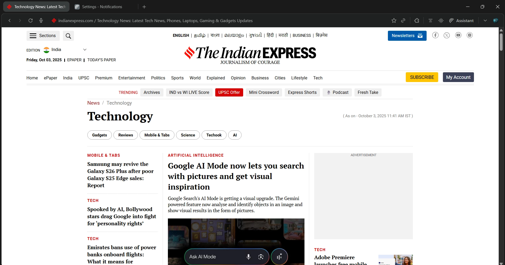

# Perplexity推出免费AI浏览器Comet：它和Chrome、Firefox到底有什么不同?

---

最近，Perplexity把自家的AI浏览器Comet向所有Mac和Windows用户免费开放了。这个浏览器不是那种你打开一堆标签页然后找不到哪个是哪个的传统浏览器——它更像是给那些每天泡在网上工作、研究、找资料的人准备的"智能工作台"。

说实话，如果你只是偶尔上网刷刷新闻，Comet可能不太适合你。但如果你是那种一天要开20个标签页、在不同网站之间跳来跳去找信息的人，这个浏览器可能会让你觉得"终于有人懂我了"。

---

## Comet到底长什么样？

先说最直观的：Comet没有传统浏览器那种密密麻麻的标签栏。

它用的是"工作空间"概念。你可以把它想象成一个整理好的桌面，所有你需要的信息都摆在那里，不用在一堆标签页里翻来翻去。界面很简洁，没有那些花里胡哨的东西。

之前这个浏览器只对付费用户开放，结果有几百万人排队等着试用。现在免费了，任何人都能下载体验。

---

## 核心功能：Comet助手

Comet最厉害的地方是它的AI助手——就像Edge里的Copilot，但更懂你在干什么。

你可以随时呼出这个助手，让它帮你：
- **总结网页内容**：看到一篇长文章？让助手给你提炼重点
- **回答问题**：不用离开当前页面，直接问"这篇文章的主要观点是什么？"
- **代替你操作**：比如填表单、导航到特定页面

更聪明的是，Comet会记住你看过什么、读过什么、正在做什么。然后根据这些信息，主动推荐相关内容。

举个例子：你上午在研究某个技术问题，下午打开浏览器时，它会提醒你"上次你在看这个，要继续吗？"还会把不活跃的标签页自动关掉，省得你的电脑卡成PPT。

👉 [想了解更智能的AI搜索体验？试试这个](https://pplx.ai/ixkwood69619635)

---

## 每个标签页都有独立的AI助手

这个设计挺有意思的。

传统浏览器里，你开10个标签页，就是10个独立的网页，互不相干。Comet不一样——每个新标签页都有自己的AI助手。

这意味着什么？你可以同时在不同标签页里问不同的问题，互不干扰。比如：
- 第一个标签页：让AI帮你总结一篇论文
- 第二个标签页：让AI帮你比较两款产品的价格
- 第三个标签页：让AI帮你规划旅行路线

所有这些任务可以并行进行，不用等一个完成再开始下一个。

---

## 内置的实用工具

除了AI助手，Comet还自带了一些工具，直接集成在浏览器里：

- **Discover**：个性化新闻推荐，有点像OpenAI的Pulse
- **购物助手**：快速比价，找最划算的deals
- **旅行工具**：规划行程、查航班酒店
- **金融、体育等专项工具**：针对特定需求优化

这些工具不是插件，是原生集成的。打开就能用，不用到处找扩展程序。

---

## 免费版和付费版的区别

虽然Comet现在免费了，但有些功能还是只给付费用户（Perplexity Max订阅者）。

**免费用户能用的：**
- 基础的AI助手功能
- 工作空间管理
- 内置工具（购物、旅行等）

**付费用户独享的：**
- **邮件助手**：帮你起草回复邮件，还能模仿你的语气
- **后台助手**：在后台执行多个任务，你可以同时做其他事情

说实话，免费版已经够用了。除非你每天要处理大量邮件，或者需要同时跑很多任务，否则不用急着付费。

---

## Comet适合谁？

这个浏览器不是给所有人准备的。

**如果你是这样的人，Comet可能很适合你：**
- 每天大量时间在网上工作
- 需要频繁查资料、做研究
- 经常在多个网站之间跳转
- 希望浏览器能"懂"你在做什么，主动帮忙

**如果你只是偶尔上网刷刷新闻、看看视频，Chrome或Firefox可能更合适。**

Comet的目标很明确：它想让那些"以网络为工作场所"的人，不用再在传统搜索引擎和一堆标签页之间疲于奔命。

---

## 它会取代Chrome吗？

短期内不太可能。

Chrome的优势在于生态——扩展程序多、兼容性好、大家都习惯了。Comet现在还是个新玩家，很多人可能连听都没听过。

但对于特定人群——比如研究人员、内容创作者、需要大量网络调研的工作者——Comet提供的"智能工作空间"确实比传统浏览器更高效。

它不是要和Chrome正面硬刚，而是在开辟一个新赛道：**AI原生的工作浏览器**。

---

## 总结

Perplexity的Comet浏览器现在免费了，这对那些每天泡在网上工作的人来说是个好消息。它不是传统浏览器的简单升级，而是重新思考了"浏览器应该是什么样子"。

如果你厌倦了在一堆标签页里找不到北，或者希望浏览器能更懂你在做什么、主动帮你整理信息，👉 [不妨试试Perplexity的AI搜索和浏览体验](https://pplx.ai/ixkwood69619635)。

当然，它不会适合所有人。但对于那些真正需要它的人来说，Comet可能会成为工作流程中不可或缺的一部分。
